<p>&nbsp;</p>

```{r, include=FALSE}
library(knitr)
```

## What is R?

R is a free, open-source programming language used predominantly in the field of statistics and data analysis. It was developed in the 1990s by Ross Ihaka and Robert Gentleman at the University of Auckland, and is a modern-day implementation of S, an earlier statistical programming language. Some of R's capabilities include:

* parsing, filtering, ordering, and manipulating datasets
* performing advanced statistical analyses on datasets
* visualizing data through plots and figures
* creating formatted documents and presentations (such as this handout)
* creating interactive dashboards through Shiny

<p>&nbsp;</p>

## What is RStudio?

RStudio is an interface for programming in R. While R can be run entirely from text commands, it is useful to have the full complement of toolbars, dropdowns, and windows that is provided through RStudio.

<p>&nbsp;</p>

## A First Look at RStudio

The following workspace appears upon opening RStudio for the first time:
$\;$

```{r, echo=FALSE, out.width = "90%", fig.align="center", fig.cap="A blank RStudio workspace"}
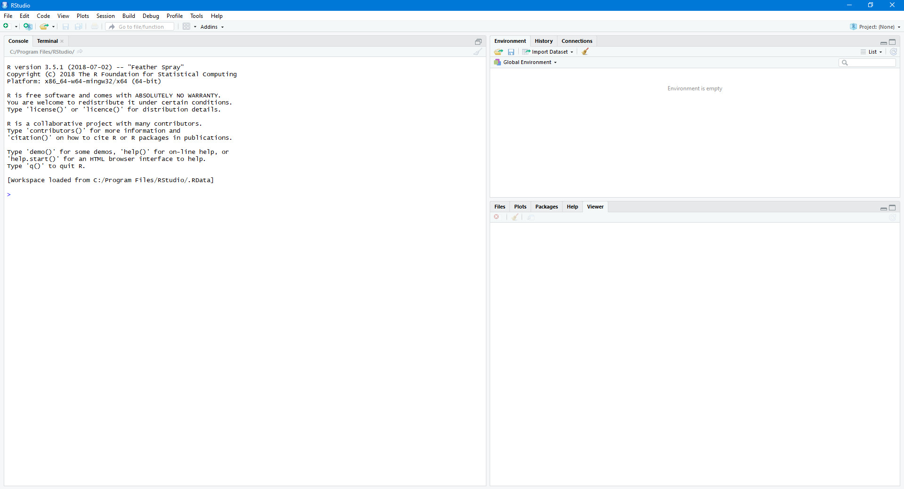 
```

The window on the left-hand side of the workspace is the Console. The Console allows users to talk to R through commands or expressions. For example, type `10` in the Console and hit `Enter`:

```{r}
10
```

R evaluates the given expression and prints out the value 10, since 10 = 10. We may also try some more complicated expressions, such as:

```{r}
2 + 5
```

Or:

```{r}
17 / (2 + 1)
```

As evident, R can perform mathematical computations through the Console. Additionally, we may talk to R via text. Text in R is surrounded by either double quotes (" ") or single quotes (' '). For example:

```{r}
"Hello!"
```

<p>&nbsp;</p>

### Using Variables

Now that we know how to calculate values in the Console, we may wish to save those values for future use. To do so, we must store the desired values in variables. This process of storing a value in a variable is called *assignment*, since we are assigning a value to the variable.

Type `x <- 2 + 5` in the Console and hit `Enter`:

```{r}
x <- 2 + 5
```

This assigns the value of 7 to a variable called `x`. Assignment commands follow a specific format that consists of:

* a variable name
    + this is the name that you use to retrieve the variable in the future
    + it may contain letters, numbers, underscores, and periods, but must start with either a letter or a period followed by a letter (Note: R is case sensitive)
* an assignment operator
    + either `<-` or `=`; they are generally equivalent
* an expression
    + the value that the variable will take on
    
Variables can be overwritten by re-assigning a different value to them:

```{r}
x <- 1500
```

And they can be referenced in assignments to other variables:

```{r}
y <- x * 3
```

Or in assignments to themselves:

```{r}
x <- x + 1000
```

We can even change the type of the value stored in a variable:
```{r}
x <- "abcde"
```

<p>&nbsp;</p>

### The Environment

You may have noticed that as we defined our variables, they appeared in the top, right-hand window under the Environment tab. The Environment contains all of the variables that we have defined so far as well as their values. The Environment tab is a useful, at-a-glance tool for keeping track of what is in the workspace, especially as datasets and calculations become more complex.
$\;$

```{r, echo=FALSE, out.width = "90%", fig.align="center", fig.cap="The Environment tab"}
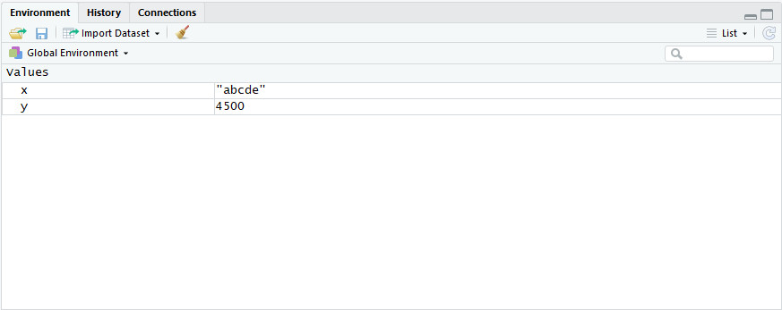 
```

<p>&nbsp;</p>

### Vectors

The true power of R comes in its ability to work not only with single values but with *vectors* of values. A vector in R can be thought of as an array, or series, of values. For example, revenue over a span of 10 years might be stored as a vector of 10 values.

The most basic way to create a vector is by using the `c(...)` notation. Type `myFirstVector <- c(45, 31, 22, 41, 38, 33, 14)` in the Console and hit `Enter`:

```{r}
myFirstVector <- c(45, 31, 22, 41, 38, 33, 14)
```

A new variable appears in the Environment with the name `myFirstVector`, but this time, it is a vector of 7 values rather than a single value. Type `myFirstVector` in the Console to display its contents:

```{r}
myFirstVector
```

<p>&nbsp;</p>

#### Shortcuts to Generating Vectors

R syntax also allows for shortcuts in creating some common types of vectors. A vector of numbers that increment by 1 can be created using the ':' notation, such as:

```{r}
1:10
```

Or:

```{r}
0.4:3.4
```

A more general version of this uses the `seq(..., by = ...)` notation. For example, the following code results in a vector of numbers that starts from 1, ends at 31, and takes every 3rd number:

```{r}
seq(1, 31, by=3)
```

*(ASIDE: Note the '`=`' notation here. Using `by <- 3` will accomplish the same result in this particular case, but it will also create a variable called `by`. Avoid using '`<-`' unless explicitly performing an assignment.)*

You may also find the `seq(..., length.out = ...)` command useful. The following code generates a sequence of 6 equally-spaced values from 1 to 31 inclusive:

```{r}
seq(1, 31, length.out=6)
```

The `rep(...)` notation generates a vector of repeated values, for example:

```{r}
rep(0,12)
```

Which returns a vector of 12 zeroes.

`LETTERS` and `letters` are built-in variables that contain a vector of all the capital and lowercase letters respectively:

```{r}
LETTERS
letters
```

While `month.name` and `month.abb` contain the months of the year in full and abbreviated:

```{r}
month.name
month.abb
```

<p>&nbsp;</p>

#### Accessing Elements of Vectors

Each individual value in a vector is called an element. To access an element, provide the index number at which the element occurs, enclose it in square brackets, and place it directly after the name of the vector. The following code retrieves the 2nd element in `myFirstVector`, which is 31:

```{r}
myFirstVector[2]
```

We may also access multiple elements at the same time by putting a vector within the square brackets. Type `myFirstVector[1:4]` in the Console and hit `Enter` to get the first four elements of `myFirstVector` as a vector:

```{r}
myFirstVector[1:4]
```

Using the shortcuts above, we can create more complicated splices of existing vectors such as:

```{r}
month.name[seq(1,12,by=2)]
```

Which returns the names of all odd-numbered months.

<p>&nbsp;</p>

#### A Brief Note on Vector Operations

Performing mathematical operations on a numerical vector applies those operations to each element of the vector. For example, to decrease each element in `myFistVector` by 5, perform the following assignment:

```{r}
myFirstVector <- myFirstVector - 5

myFirstVector
```

This functionality allows for mass numerical computation over an entire series of data.

#### Ordering Vectors

A common manipulation that one would like to perform with vectors is sorting them. This procedure is done in R using the `order(...)` function. Return to `myFirstVector` as an example:

```{r}
myFirstVector
```

We would like to order the elements from least to greatest. Type `order(myFirstVector)` in the Console and hit `Enter`:

```{r}
order(myFirstVector)
```

We see that we do not quite what we were expecting. The `order(...)` function in R does not actually provide a sorted vector, but rather a vector of indices that indicate the positions of the elements from least to greatest. This issue is easily remedied using our knowledge of accessing vector elements:

```{r}
myFirstVector[order(myFirstVector)]
```

If we place a hyphen in the syntax before the second occurrence of `myFirstVector`, we get the vector sorted in descending order:

```{r}
myFirstVector[order(-myFirstVector)]
```

*(ASIDE: While there is a `sort(...)` function in R that eliminates the extra step, understanding `order(...)` will be more useful as we start working with data frames.)*

<p>&nbsp;</p>

## Data Frames

The data frame in R is R's way of storing tabular data. It is best thought of as a collection of equal-length vectors, such that each vector represents one column of data. We can construct data frames using the `data.frame(...)` syntax or read them in from external sources such as a CSV file. Generally, we will assign data frames to variables so that we can access them later.

The following code creates a data frame called `df` with three columns:

```{r}
df <- data.frame(id=1:7, month=month.name[1:7], miles_run=myFirstVector)
```

The syntax for creating and assigning a data frame consists of:

* a variable name
* an assignment operator ('`<-`' or '`=`')
* the expression `data.frame(...)`, where '`...`' is a list of arguments (or ingredients) needed to construct the data frame
    + each argument represents one column of data
    + the syntax for an argument is `<column name> = <column value>`
    + `<column name>` is the name that you would like the column to take
    + `<column value>` is the corresponding vector of data for the column

<p>&nbsp;</p>
Immediately after running the code above, a new entry appears in the Environment tab. RStudio recognizes that `df` is a data frame and puts it under a separate heading from the other variables:
$\;$

```{r, echo=FALSE, out.width = "90%", fig.align="center", fig.cap="The Data heading"}
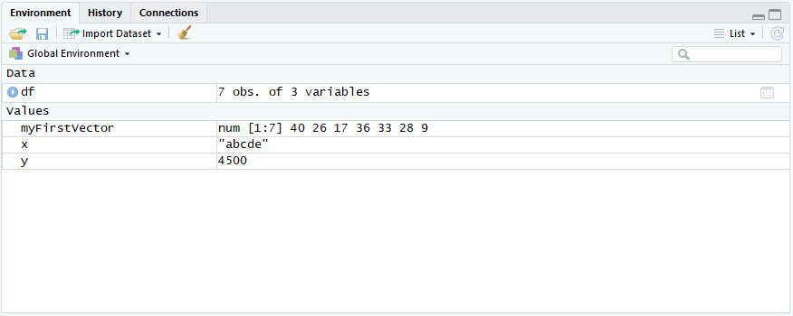 
```

In the Environment tab, click on `df` under the Data heading. A new view tab opens above the Console and we can see the data frame in tabular form:
$\;$

```{r, echo=FALSE, out.width = "87%", fig.align="center", fig.cap="The Data viewer"}
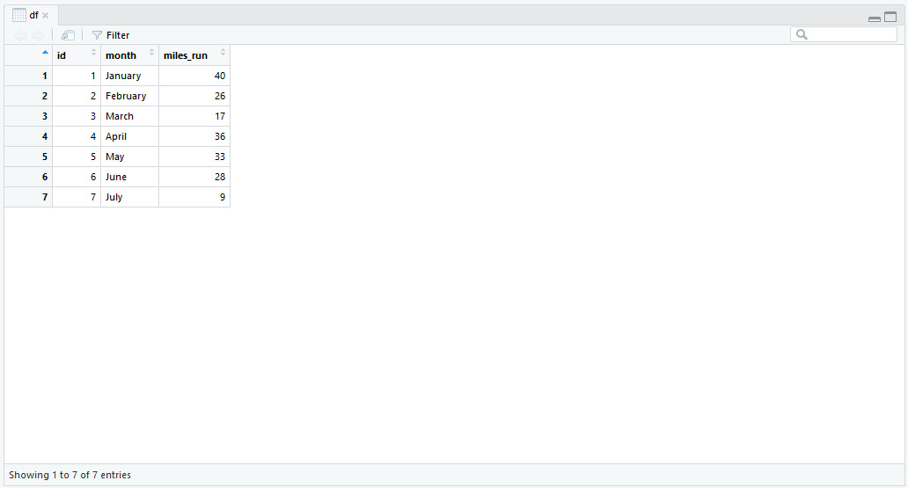 
```

Click on the arrows in the headings of each column to sort the columns in ascending or descending order. You may also use the basic `Filter` feature from the button directly above the table to filter each column. Note that applying these changes in the view tab *does not* actually change `df`; to do so, you must programmatically assign a new data frame to `df`.
$\;$

```{r, echo=FALSE, out.width = "87%", fig.align="center", fig.cap="Filtering a data frame in the viewer", fig.show='hold'}
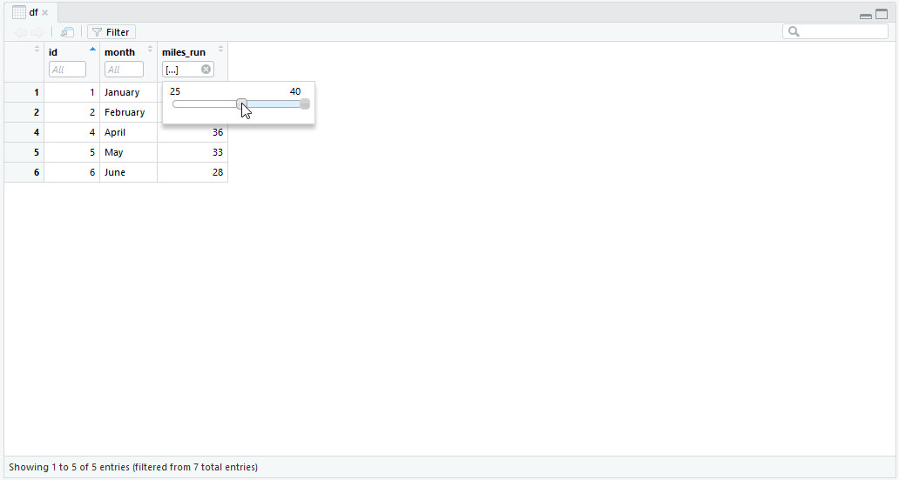 
```

<p>&nbsp;</p>

### Accessing Rows, Columns, and Elements in a Data Frame

In the case of vectors, we provided a single index in order to retrieve a specific element. For data frames, we must provide two indices: a row number and a column number. The row and column numbers are separated by a comma and placed within square brackets.

To find the number of miles run in February, search for the 3rd entry in the 2nd row as follows:

```{r}
df[2,3]
```

If a row number is not specified, the entire column is retrieved as a vector:

```{r}
df[,3]
```

Likewise, if a column number is not specified, we get the entire row. Observe that the row is returned as a data frame with one row rather than as a vector:

```{r}
df[2,]
```

Specifying neither the row nor the column simply returns the original data frame:

```{r}
df[,]
```

As before, we can access multiple rows or columns by placing the appropriate vectors within the square brackets. The following code extracts the first four rows in the second and third columns:

```{r}
df[1:4,c(2,3)]
```

In practice, it is not convenient to memorize the numerical indices of each column or row. R provides several other ways to reference columns and rows. For columns, we may access them by putting the name of the column as a text string in the column specifier, as below:

```{r}
df[,"id"]
```

Accessing more than one column returns a data frame rather than a vector:

```{r}
df[1:5,c("month","miles_run")]
```

Another way to access an individual column is to use the '`$`' notation. To get the number of miles run, simply type:

```{r}
df$miles_run
```

We can access rows in a similar manner by assigning row names. This can be done by specifying the names while creating the data frame or by assigning them to an existing data frame. For example, assume we wanted to call the rows "obs_1", "obs_2", ... , "obs_7". We first create a vector of the row names and save it to the variable `rnames`:

```{r}
rnames <- paste0("obs_", 1:7)
```

*(ASIDE: the `paste0(...)` function glues text together with no whitespace. It is very useful for generating text that contains numerical sequences. Confirm that the code above does in fact generate the desired row names.)*

To assign row names while creating a data frame, add a `row.names=...` argument as follows:

```{r}
data.frame(id=1:7, month=month.name[1:7], miles_run=myFirstVector, row.names=rnames)
```

We already have `df` defined, so instead we add the row names using the following assignment:

```{r}
row.names(df) <- rnames
```

`row.names(...)` retrieves the current row names of the data frame provided. We can treat this result as a variable and assign new row names to it. Type `df` in the console and hit `Enter` to confirm that we have renamed the rows as desired:

```{r}
df
```

Now, we may use the row names to access specific rows:

```{r}
df["obs_2",]
df[c("obs_4","obs_5"),]
```

<p>&nbsp;</p>

### Filtering, Extending and Sorting Data

The ability to select specific rows allows users to filter observations by specific characteristics. For example, if we wanted to retrieve only the months in which we have run more than 25 miles, we can place the desired criterion in the row selector as follows:

```{r}
df[df$miles_run > 25,]
```

This syntax makes use of a *logical operator*. We access the miles_run column using the '`$`' notation and require that it be strictly greater than 25. Below is a list of the logical operators in R:

```{r, echo = FALSE}
logOp.df <- data.frame(Operator=c(">","<",">=","<=","==","!="),
                       Description=c("Greater than", "Less than","Greater than or equal to",
                                     "Less than or equal to","Equals","Does not equal"))
kable(logOp.df, caption="List of logical operators in R")
```

Additionally, we may specify multiple criteria using the AND and OR conjunctions listed below:

```{r, echo = FALSE}
andOr.df <- data.frame(Symbol=c("&","|"), Description=c("And", "Or"))
kable(andOr.df, caption="AND and OR syntax in R")
```

The following code finds the months during which less than 30 miles were run, excluding July:

```{r}
df[df$miles_run < 30 & df$month != "July",]
```

Suppose now that we have new data for July and August:

```{r}
df2 <- data.frame(id=c(8,9), month=c("July","August"), miles_run=c(15,33),
                  row.names=c("obs_8","obs_9"))
df2
```

<p>&nbsp;</p>
We can add this data to the bottom of the original data frame using the `rbind(...)` command. Data frames combined using `rbind(...)` must have the same column names. Place the data frames to be combined in order from top to bottom within the parentheses. Here, we deliberately invert the ordering for demonstration purposes:

```{r}
df <- rbind(df2,df)
df
```

To order the data, recall the `order(...)` function from an earlier section. The `order(...)` function returns the indices of a vector that would result in the elements of the vector being sorted in ascending or descending order. We may place this expression inside the row selector when accessing a data frame. The following code sorts by `id` in ascending order:

```{r}
df[order(df$id),]
```

We may also add arguments to the `order(...)` function to sort by multiple columns. The columns to be sorted are placed in order of priority. Suppose we wished to sort the number of miles run in descending order and then break any ties by sorting id in ascending order:

```{r}
df[order(-df$miles_run, df$id),]
```

<p>&nbsp;</p>

### Merging Data

Now suppose that we have another table of data, named myData, containing some other data by month:

```{r}
myData <- data.frame(month=month.name[3:10], code=letters[3:10])
myData
```

We can merge the data in `df` and `myData` using the `merge(...)` command:

```{r}
merge(df, myData, by="month")
```

To merge two data frames, the user must specify:

* the first table to be merged, called the "x" or "left" table
* the second table to be merged, called the "y" or "right" table
* a reference column by which to merge the data
    + include an argument of the form `by=` followed by the name of the desired column in quotes
    
By default, R will include only rows for which the reference element exists in *both* tables. Additional parameters can be specified in the `merge(...)` function to change the nature of the merge:

```{r, echo = FALSE}
merge.df <- data.frame(Operator=c("all.x=TRUE","all.y=TRUE","all=TRUE"),
                       Description=c("Reference must exist in the first table",
                                     "Reference must exist in the second table",
                                     "Reference must exist in at least one table"))
kable(merge.df, caption="Additional merge parameters")
```

For example, we may perform a "full" merge of the two data frames as follows:

```{r}
merge(df, myData, by="month", all=TRUE)
```

Blank table entries are denoted by `NA`. Verify that all rows from both data frames are present.

<p>&nbsp;</p>

### Additional Remarks

Since data frames are often large, you may wish to remove them from the Environment once you are done using them. To do so, simply type `rm(<variable name>)` in the Console. The specified variable will disappear from the Environment tab and will not appear again until you run a command to define it.

We are done using `df2`, so we remove it from the Environment as follows:

```{r}
rm(df2)
```

This command will fail if the variable does not already exist.

<p>&nbsp;</p>

## Writing an R Script

Now that we have thoroughly explored R syntax through the Console, we may wish to reproduce our efforts in a script that can be saved and distributed to other users. To open a blank script, click on `File > New File > R Script` in the toolbar at the top left or use the shortcut `Ctrl + Shift + N`. Equivalently, you may click on the ribbon icon shown below and select the `R Script` option:

```{r, echo=FALSE, out.width = "90%", fig.align="center", fig.cap="Opening a new R script"}
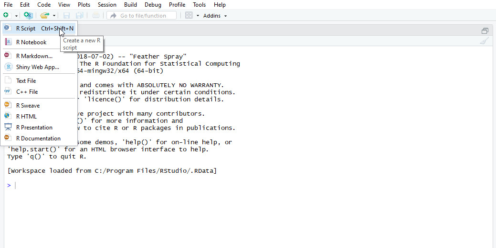 
```

A new, untitled window opens above the Console:

```{r, echo=FALSE, out.width = "90%", fig.align="center", fig.cap="Opening a new R script"}
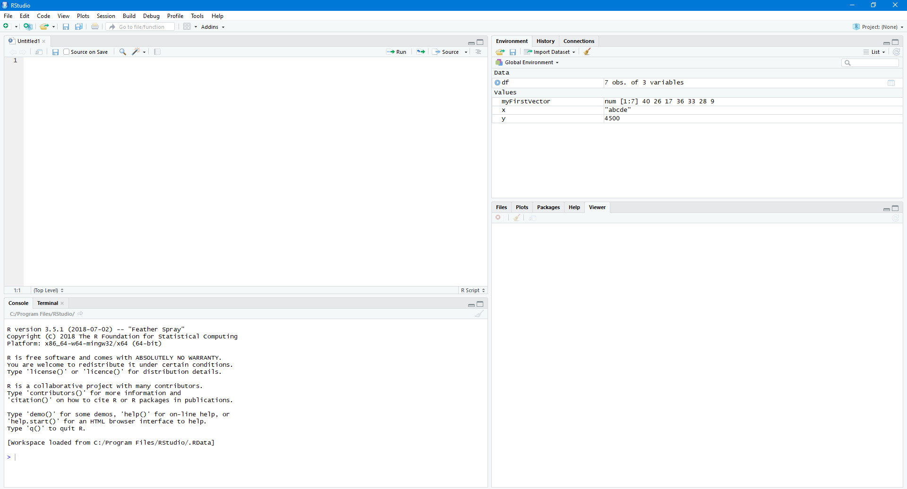 
```

In this window, we are free to type all the commands as before. We define a few new variables:

```{r}
a <- 2
b <- 3
myFirstVector <- c(40, 26, 17, 36, 33, 28, 9)
df <- data.frame(id=1:7, month=month.name[1:7], miles_run=myFirstVector)
```

And perform some operations:

```{r}
b <- a + b
myFirstVector <- sort(myFirstVector)
```

Each statement starts on a new line. Unlike in the Console, simply typing a line and hitting `Enter` does not automatically execute the code. We must run the code in order for it to execute.

We may also write comments in the script window, which are lines that do not execute when the program is run. Comments in R are preceded by a '`#`' symbol, such as:

```{r}
# This is a comment
# R is fun
```

RStudio will colour comments in green.

To save an R script, hit `Ctrl + S` or click on the appropriate save button in the header. R scripts are saved with the .R extension.

```{r, echo=FALSE, out.width = "90%", fig.align="center", fig.cap="An R script"}
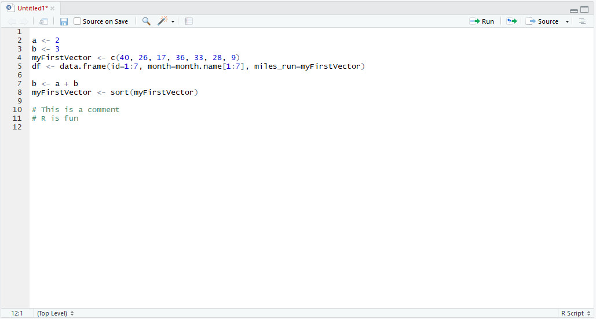 
```

The `Run` button in the upper, right-hand corner of the script window allows us to run our code. Clicking on it will run *only the line that the cursor is currently on*. To run multiple lines, highlight the desired lines and click `Run`. The keyboard shortcut `Ctrl + Shift + Enter` will run the entire script.

When code is executed, variables defined in the code appear in the Environment. R expressions that are not assigned to variables are, in general, evaluated, printed to the Console, and discarded. Ensure that all necessary data are either used immediately or saved to the appropriate variables for future use.

<p>&nbsp;</p>

### Creating Functions

A function in R is a pre-defined procedure that can be performed repeatedly by referencing its name. We have already encountered a number of functions in this tutorial, including `merge(...)`, `order(...)`, and `c(...)`. In general, a function can be thought of as a machine that takes in a number of inputs and produces an output or a *side-effect* somewhere else in the code.

R provides many built-in functions that can be used as they are. To learn more about a function, type `?` in the Console followed by the name of the function. For example, if we did not know how to use the `merge(...)` function, we would type the command `?merge` in the Console. This will display information about the function in the Help tab in the bottom, right-hand window.

Alternatively, you may use the `help(...)` function in place of '`?`'.

To define our own function, we must perform an assignment, but instead of assigning a vector or a data frame to the variable, we assign a function. The syntax for a function definition is very specific and adheres to the following format:

```{r}
functionName <- function(...) { # replace '...' with parameter names
  # do stuff here
  
  return( ) # place your function output in the parentheses
}
```

The most trivial function is:

```{r}
nothing <- function() {
  return()
}
```

Which takes no input, does nothing, and returns no output (i.e. a non-function). However, if we run the code for the function above, we notice that a new entry appears in the Environment tab. A function is a special type of value, and RStudio keeps tracks of all the functions that we define in our workspace under its own heading.

To use our "nothing" function, type the syntax `nothing()`. We can assign the result to a variable, but there is no point since the function does not do anything. Instead, type `nothing()` into the Console to see its result once:

```{r}
nothing()
```

```{r, echo=FALSE, out.width = "90%", fig.align="center", fig.cap="The nothing() function"}
include_graphics("images/nothing.jpg") 
```

We would like to write functions that are useful and that we might wish to reuse in the future. For example, suppose we are working with monthly data and are only interested in data from January, February, and March. Suppose we know as well that any data we work with will have a "month" column. We may wish to write a function that takes in a data frame and returns a filtered data frame that only contains data from January to March. The code for this function is shown below:
<p>&nbsp;</p>

```{r}
firstQuarter <- function(data) { # accepts a data frame as input and aliases it as 
                                  # 'data' everywhere inside the function
  
  correctMonths <- c("January", "February", "March")
      # creates a vector of the months that we want
  
  output <- data[data$month %in% correctMonths,]
      # retrieves only rows for which "month" is in the vector of desired months;
        # we check "in" using the "%in%" syntax
  
  return(output)
      # returns the filtered data frame
  
}
```

Run the code to define the `firstQuarter` function. We can now use `firstQuarter(<data>)` from both the Console and in our script. Here, we do it in the Console using our `df` data:

```{r}
firstQuarter(df)
```

<p>&nbsp;</p>

## A Worked Example

Now that we have familiarized ourselves with R scripts, we may begin writing reproducible code to help us perform data analysis.

Many of the data analysis and visualization tools in R exist in packages, which are extensions of R's capabilities. These packages must be installed separately and included in our R code. To install a package, type `install.packages(...)` in the Console, where '...' is the name of the package that you wish to install. For this example, we will install the `ggplot2` package, which allows us to generate complex and well-formatted plots for data visualization:

```{r, eval = FALSE}
install.packages("ggplot2")
```

The installation of a package only needs to be performed once. To use the package in your code, type:

```{r, warning = FALSE}
library(ggplot2)
```

At the top of your R script.

Inside the `ggplot2` package, there is also a built-in dataset called `mpg`, which contains the specs of various models of cars. In this example, we will be working with the `mpg` dataset which has been copied to an Excel spreadsheet called `car_data.xlsx`:

```{r, echo=FALSE, out.width = "90%", fig.align="center", fig.cap="The mpg data"}
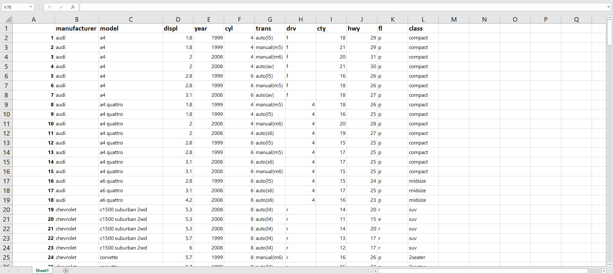
```

To read Excel files, we will require another package. In the Console, type `install.packages("readxl")` to install the `readxl` package:

```{r, eval = FALSE}
install.packages("readxl")
```

Include `readxl` in your code by adding `library(readxl)` at the top of the script:

```{r, warning = FALSE}
library(readxl)
```

The `readxl` package contains a function called `read_excel(...)`, which allows the user to read Excel spreadsheets into R as data frames. For now, we go to the Console and type:

```{r, eval = FALSE}
carData <- read_excel(file.choose())
```

`file.choose()` opens a window that allows users to specify an Excel file to be opened. We run the above code, follow the prompts, and get an error:

```{r, echo = FALSE}
"Error: Evaluation error: 'exdir' does not exist."
```

This error will not always occur, but it usually does when we try to use `read_excel(...)` without any prior configuration. The error is caused by the location of R's *working directory* in relation to the file that we are trying to open.

The working directory in R is the reference directory location from which R reads files. It is also the default location to which R writes any files that it creates. Typically, the working directory is where you first installed RStudio; you can check the location of your working directory using the `getwd()` command in the Console:

```{r, eval = FALSE}
getwd()
```

```{r, echo = FALSE}
"C:/Program Files/RStudio"
```

The full path of the Excel file that we are opening (for the author of this handout) is:

```{r, echo = FALSE}
"C:/Users/SIWANG/Documents/R/CoP_presentation/car_data.xlsx"
```

The error occurs because `car_data.xlsx` is not in any subdirectory of the working directory and thus, R cannot find it. To change the working directory, use the `setwd(...)` command. Here, we set the working directory to the folder containing `car_data.xlsx`:

```{r, eval = FALSE}
setwd("C:/Users/SIWANG/Documents/R/CoP_presentation")
```

Now we are free to read in the desired Excel file. Instead of using the `file.choose()` command, we simply type:

```{r}
carData <- read_excel("car_data.xlsx")
```

Since we know that `car_data.xlsx` is in the working directory. We can include this in the script rather than run it in the Console. Then, each time we run the R code, we will have a copy of the data for the code to use.

```{r, echo=FALSE, out.width = "90%", fig.align="center", fig.cap="The mpg data in RStudio"}
include_graphics("images/car_data_in_viewer.jpg")
```

Suppose we are interested in exploring the relationship between city and highway mpg. We find this data in the `cty` and `hwy` columns respectively. First, create a scatter plot of the data using the `plot(...)` function in R:

```{r, fig.align="center"}
x <- carData$cty
y <- carData$hwy
plot(x, y, main="Highway vs city mpg ratings", xlab="City mpg", ylab="Highway mpg")
```

In the code above, we assigned the city mpg data to a variable called `x` and the highway mpg data to a variable called `y`. The `main`, `xlab`, and `ylab` arguments allow us to specify a title and x- and y-axis labels respectively. To learn more about the arguments that `plot(...)` accepts, type `?plot` or `help(plot)` in the Console.

As soon as you run the code, a plot appears in the Plots tab in the bottom, right-hand window. All plots generated by R scripts in RStudio appear in the Plots tab. To save a plot, click on the `Export` button along the top of the tab and select an appropriate format for the file.

```{r, echo=FALSE, out.width = "70%", fig.align="center", fig.cap="The Plots tab"}
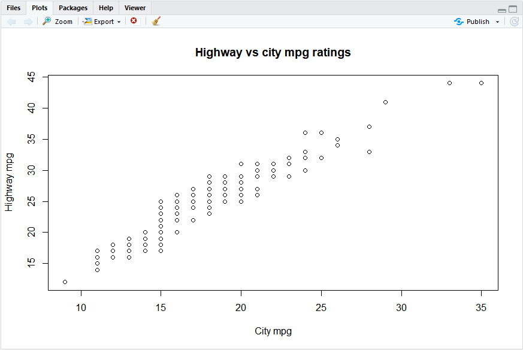
```

We may also wish to draw a line of best fit for the data. To do so, use the `lm(...)` function. The `lm(...)` function takes a *formula* argument to tell it which variables to generate the linear model for. We want a model of `y` against `x`. In the Console, type `lm(y ~ x)` (with a tilde between `y` and `x`) to see the output generated by `lm(...)`:

```{r}
lm(y ~ x)
```

`lm(...)` returns the coefficients $a$ and $b$ of the line $y = a + bx$ of best fit. To put the line on the plot, use the `abline(...)` function immediately after the plot function. The code provided below performs a linear fit of `y` against `x`, generates a new plot (with some stylistic changes), and then adds the line of best fit to the plot:

```{r, fig.align="center", echo = 2:5}
par(mar=c(4, 4, 4, 2))
lmodel <- lm(y ~ x)
plot(x, y, main="Highway vs city mpg ratings", xlab="City mpg", ylab="Highway mpg",
     pch=19, col=adjustcolor("firebrick", 0.3))
abline(lmodel)
```

Note that the increased transparency of the data points reveals many overlaps and gives a sense of depth to the data.

We will also create a very simple `ggplot` to demonstrate the package that we have installed. `ggplot`s are created using the `ggplot(...)` constructor. It is useful to think of `ggplot`s as being constructed in layers. To generate the base layer, we must call `ggplot(...)` and specify a data frame from which our data will be extracted, as well as a column to represent our `x` data and a column to represent our `y` data:

```{r, fig.height=3.5, fig.width=5.5, fig.align="center"}
ggplot(mpg, aes(x=cty, y=hwy))
```

New layers are added using the '`+`' symbol and other `<gg>` functions. We add a layer that contains all the data points, another layer that contains the title, and a third layer that contains the line of best fit:

```{r, fig.height=3.7, fig.width=6, fig.align="center"}
# saves coefficients from our previous linear model as separate variables
a <- lmodel$coefficients[1]
b <- lmodel$coefficients[2]

ggplot(mpg, aes(x=cty, y=hwy)) +
    
  # adds points; point size by frequency
  geom_count(colour="firebrick", alpha=0.5) + 
  
  # adds title
  ggtitle("Highway vs city mpg ratings") +
  
  # adds line of best fit
  geom_abline(intercept=a, slope=b)
```

Using `geom_count(...)` instead of `geom_point(...)` allows us to visualize overlapping data by changing the size of the points based on frequency. We can build increasingly nuanced `ggplot`s by adding elements to the plot one at a time. A complete function reference for the `ggplot2` package can be found at https://ggplot2.tidyverse.org/reference/.

We my also include plots and other output in customizable dashboards using the `shiny` package. Below is a sample Shiny app for our mpg data:

```{r, echo=FALSE, out.width = "90%", fig.align="center", fig.cap="A Shiny application"}
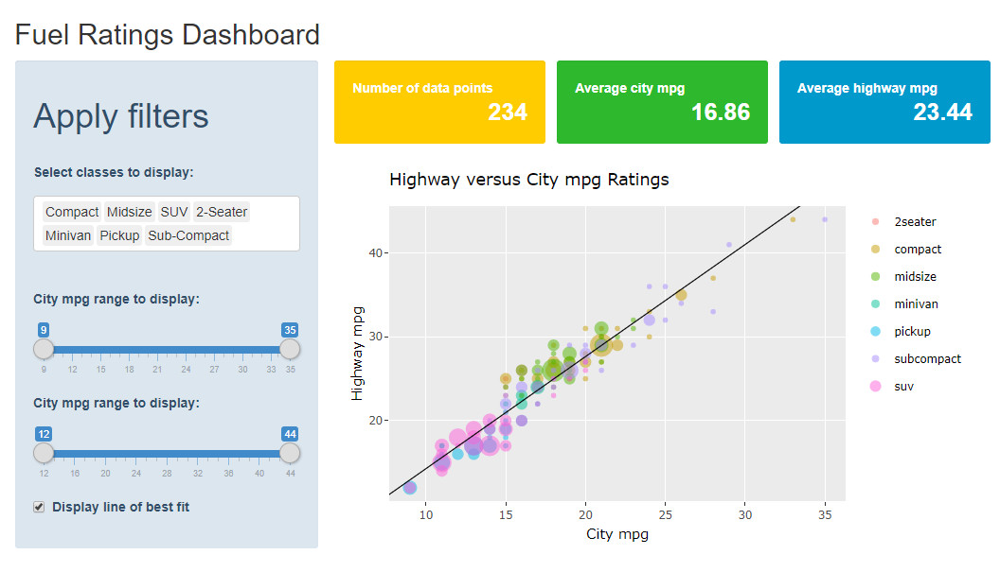
```

To learn more about Shiny, visit https://shiny.rstudio.com/tutorial/.

<p>&nbsp;</p>

## Closing Remarks

The R language is a powerful tool for data analysis capable of meeting a diverse range of workplace needs. Its easy-to-understand syntax and large repository of external packages make it a valuable asset in all data-oriented settings.

While this tutorial provides only a glimpse of the world of R, it will hopefully open the door to many more possibilities for insight and innovation.

If you have any additional questions, please feel free to address them to sijia.wang@canada.ca or manolo.malaver-vojvodic@canada.ca.

<p>&nbsp;</p>

<p>&nbsp;</p>